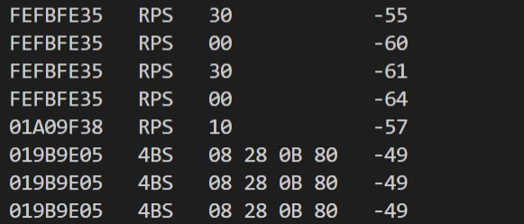

EnOcean Library for Arduino
====
`EnOcean Library for Arduino` is a library of EnOcean Serial Protocol 3 (ESP3) Parser for Arduino.
EnOcean Shield (TCM310) can be used to easily acquire EnOcean wireless communication data.

## Description

This library can analyze ESP3 received by Esp32 RX2 (UART2) and acquire R-ORG, Originator ID, Data (Payload) as arguments of the set callback function.
It supports the following EnOcean protocols.

* ESP3 Packet Type 1: RADIO_ERP1
* EEP: RPS, 1BS, 4BS
* CRC8 check is omitted
* Data via Repeater is not supported.

## Demo

### Sample program: SimpleDisplay

The wireless data received by EnOcean Shield (TCM310) is displayed on the serial monitor.



## VS. DolphinView

* SimpleDisplay is a simple function version of Dolphin View
* DolphinView is used in Windows, while SimpleDisplay is used in Arduino environment.

## Requirement

* Platform IO latest

## Install

* For other than Esp32, the installed library conflicts with the existing Arduino library, so comment out "ISR (USART_RX_vect)" in [Arduino installation folder] \ hardware \ arduino \ avr \ cores \ arduino \ HardwareSerial0.cpp
* In this library, USART reception completion interrupt processing: ISR (USART_RX_vect) is added to avoid missing received data.

Comment out example:

```c
  #if 0  // Add
  #if defined(USART_RX_vect)
    ISR(USART\_RX\_vect)
  #elif defined(USART0_RX_vect)
    ISR(USART0_RX_vect)
  #elif defined(USART_RXC_vect)
    ISR(USART_RXC_vect) // ATmega8
  #else
    #error "Don't know what the Data Received vector is called for Serial"
  #endif
    {
      Serial._rx_complete_irq();
    }
  #endif  // Add
```